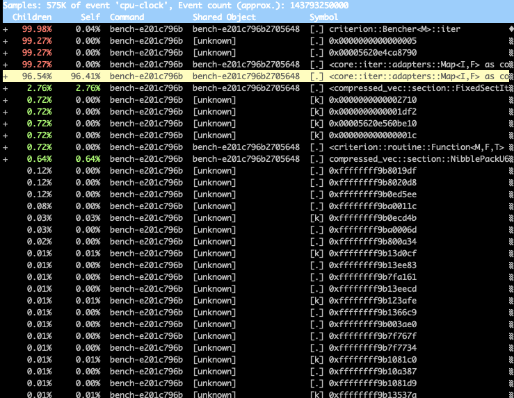

# rust-perf-docker

A Rust Docker image for performance profiling using Linux perf tool.  Super useful to get assembly hot spot and cache usage stats on Mac/OSX, for example.
The image contains `rustup`, `cargo`, `rustc` and the usual Rust development chain.

To get started:

    docker build -t rust-perf .

To run perf, one needs privileged mode.  This starts bash shell, and also mounts a local code directory in `/src`:

    docker run -it --privileged -v ~/src/rust:/src rust-perf bash

To run perf:

    perf record -g <binary>
    perf report

To run flamegraph (which creates flamegraph.svg in the dir):

    flamegraph <binary>

Note that you need to have debug symbols enabled.  Put the following in your `Cargo.toml`:

```toml
[profile.bench]
opt-level = 3
debug = true

[profile.release]
debug = true
```

## Benchmarks

Creating benchmarks and profiling them is an awesome way to improve a focused part of your code.  I highly recommend the Criterion crate for this.

Running perf and flamegraph with bench is a bit tricky. You will need to build your benchmarks with `cargo bench --no-run` and find the bench binary in `target/release/deps/bench*` first.  Then:

    perf record -g target/release/deps/bench-e201c796b2705648 --profile-time 120 "u64 vector" --bench

(substitute the bench-* with your bench binary)

`--bench` is needed with Criterion >= 3.0, and `--profile-time` ensures that the benchmark runs long enough (2 minutes in this case) for perf to collect enough data.

Now you will get a nice perf report of top methods:



Hit 'a' on any method and you get the annotate output of hot assembly instructions.

## Additional Reading

* [Analyzing performance with perf annotate](https://developer.ibm.com/technologies/linux/tutorials/l-analyzing-performance-perf-annotate-trs)
* [Rust performance: Perf and Flamegraph](https://blog.anp.lol/rust/2016/07/24/profiling-rust-perf-flamegraph/)
